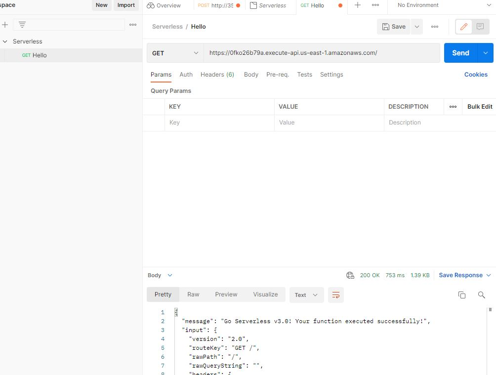
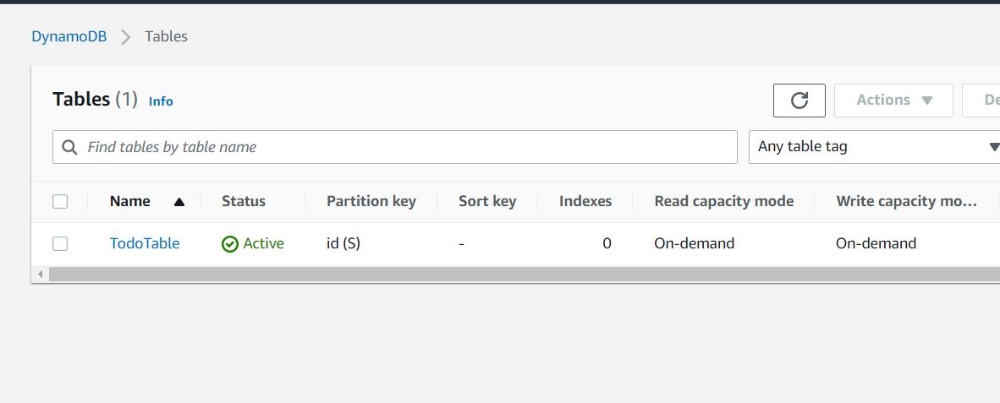
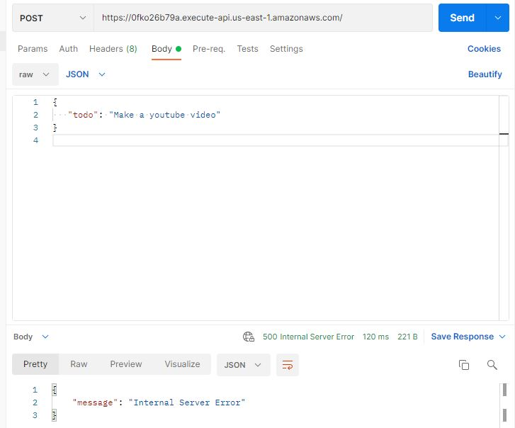
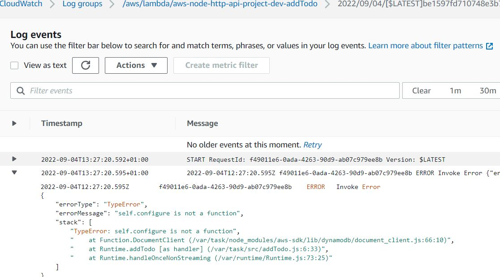
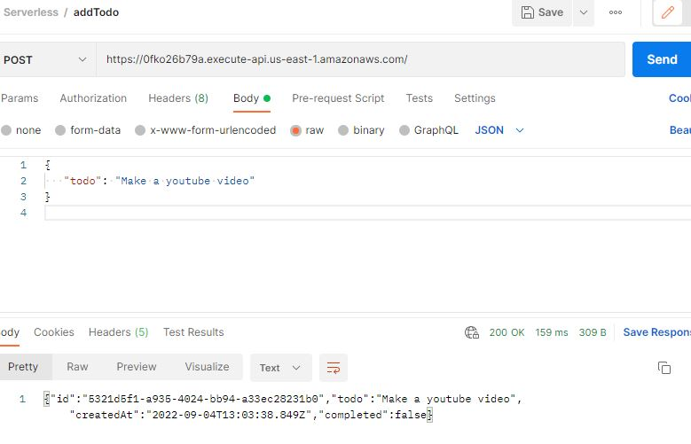

### We need to install the serveless framework and give it access to our AWS account
### Install AWS CLI if not already installed for command line access to our AWS account.
### We shall create a new user called Sereverless in the AWS console and grant that user programattic access.

### For simplicity, we shall grant adminaccess to this user. This shouldn't be done in a production enviroment.We must give no more than the access required.
```
aws configure
```
### Enter your access key ID and secret key ID when prompted

### Configured successfully
### Install serveless framwork

```
npm install -g serverless
```

### create a new serverless project
```
serverless
```
```
What do you want to make? AWS - Node.Js - HTTP API
```
### This creates a handler.js file and a serverless.yml file in our directory
## handler.js

```
"use strict";

module.exports.hello = async (event) => {
  return {
    statusCode: 200,
    body: JSON.stringify(
      {
        message: "Go Serverless v3.0! Your function executed successfully!",
        input: event,
      },
      null,
      2
    ),
  };
};
```
## .
### severless.yml
```
service: aws-node-http-api-project
frameworkVersion: '3'

provider:
  name: aws
  runtime: nodejs14.x

functions:
  hello:
    handler: handler.hello
    events:
      - httpApi:
          path: /
          method: get
```

### I added a region us-west-2

### deploy to the cloud - Our AWS account
```
serverless deploy 
```

### Lambda function and API Gateway deployed and viewed in console

### Endpoint generated in console
API endpoint: https://cp6agsj0s6.execute-api.us-east-1.amazonaws.com/

### Let's refactor our code by creating a folder src to hold all the functions

```
mkdir src
```
```
mv handler.js src/handler.js
```
### handler.js successfully moved to src folder

### next, I will edit the handler.js file
```
"use strict";

module.exports.hello = async (event) => {
  return {
    statusCode: 200,
    body: JSON.stringify(
      {
        message: "Go Serverless v3.0! Your function executed successfully!",
        input: event,
      },
      null,
      2
    ),
  };
};
```
### It will now look like this
```
"use strict";

const hello = async (event) => {
  return {
    statusCode: 200,
    body: JSON.stringify(
      {
        message: "Go Serverless v3.0! Your function executed successfully!",
        input: event,
      },
      null,
      2
    ),
  };
};
module.exports = {
    handler: hello
}
```

### I will also rename handler.js to hello.js 
```
 mv aws-node-http-api-project/src/handler.js aws-node-http-api-project/src/hello.js

```
 ### In the serverless.yml file, change handler: handler.hello   handler: src/hello.handler as below

### severless.yml
```
service: aws-node-http-api-project
frameworkVersion: '3'

provider:
  name: aws
  runtime: nodejs14.x

functions:
  hello:
    handler: src/hello.handler
    events:
      - httpApi:
          path: /
          method: get
```

### I will deploy to make sure nothing is broken

```
serverless deploy -v
```

### Visiting the gateway endpoint in the browser

```

{
  "message": "Go Serverless v3.0! Your function executed successfully!",
  "input": {
    "version": "2.0",
    "routeKey": "GET /",
    "rawPath": "/",
    "rawQueryString": "",
    "headers": {
      "accept": "text/html,application/xhtml+xml,application/xml;q=0.9,image/avif,image/webp,image/apng,*/*;q=0.8,application/signed-exchange;v=b3;q=0.9",
      "accept-encoding": "gzip, deflate, br",
      "accept-language": "en-GB,en-US;q=0.9,en;q=0.8",
      "cache-control": "max-age=0",
      "content-length": "0",
      "host": "cp6agsj0s6.execute-api.us-east-1.amazonaws.com",
      "sec-ch-ua": "\"Chromium\";v=\"104\", \" Not A;Brand\";v=\"99\", \"Google Chrome\";v=\"104\"",
      "sec-ch-ua-mobile": "?0",
      "sec-ch-ua-platform": "\"Windows\"",
      "sec-fetch-dest": "document",
      "sec-fetch-mode": "navigate",
      "sec-fetch-site": "cross-site",
      "sec-fetch-user": "?1",
      "upgrade-insecure-requests": "1",
      "user-agent": "Mozilla/5.0 (Windows NT 10.0; Win64; x64) AppleWebKit/537.36 (KHTML, like Gecko) Chrome/104.0.0.0 Safari/537.36",
      "x-amzn-trace-id": "Root=1-630d228d-2280faab11ba32761a8dd846",
      "x-forwarded-for": "90.222.128.88",
      "x-forwarded-port": "443",
      "x-forwarded-proto": "https"
    },
    "requestContext": {
      "accountId": "185439933271",
      "apiId": "cp6agsj0s6",
      "domainName": "cp6agsj0s6.execute-api.us-east-1.amazonaws.com",
      "domainPrefix": "cp6agsj0s6",
      "http": {
        "method": "GET",
        "path": "/",
        "protocol": "HTTP/1.1",
        "sourceIp": "90.222.128.88",
        "userAgent": "Mozilla/5.0 (Windows NT 10.0; Win64; x64) AppleWebKit/537.36 (KHTML, like Gecko) Chrome/104.0.0.0 Safari/537.36"
      },
      "requestId": "XpJWNibboAMEPkA=",
      "routeKey": "GET /",
      "stage": "$default",
      "time": "29/Aug/2022:20:33:17 +0000",
      "timeEpoch": 1661805197960
    },
    "isBase64Encoded": false
  }
}
```

### API endpoint created successfully as shown above

### I will now test with Postman

### Create a new collection in postman and rename the collection SERVERLESS
### Create a new request(add request) and call it Hello



### Now let's start creating the todo lambda functions
- addTodo
- fetchTod
- fetchTodos
- updateTodo

### We would need a database ans will be using AWS NoSQL database DynamoDB for our backend

### We shall add the code necessary to spin up the database to serverless.yaml

This code will create the dynamoDB table using cloudformation

```
service: aws-node-http-api-project
frameworkVersion: '3'

provider:
  name: aws
  runtime: nodejs14.x
  region: us-east-1

functions:
  hello:
    handler: src/hello.handler
    events:
      - httpApi:
          path: /
          method: get
resources:
  Resources:
    TodoTable:
      Type: AWS::DynamoDB::Table
      Properties: 
        TableName: TodoTable
        BillingMode: PAY_PER_REQUEST
        AttributeDefinitions:
          - AttributeName: id
            AttributeType: S
        KeySchema: 
          - AttributeName: id
            KeyType: HASH


```

### I will run the code again
```
sls
```

### Next I will check the console to see if our dynamoDB table (TodoTable) was created.




### Next we need to install some packages that we shall be using - uuid and aws-sdk
```
npm init
npm install uuid aws-sdk
```

### Let's create the addTodo function. We shall rename hello.js to addTodo.js
### 3 items will be sent to the database through event.body
- id
- todo
- CreatedAt

### We only need the todo from the user. id and created At will be generated.
### First we must require the uuid to be able to generate the id
```
const { v4 } = require("uuid");
const { todo } = JSON.parse(event.body);

const createdAt = new Date();

const id = v4();
```

### To save to the database, we need to use the aws-sdk by requiring it. 
```
const AWS = require("aws-sdk");
```
### This will give us access to DynamoDB
```
const dynamodb = AWS.DynamoDB.DocumentClient();
```
### Now we could put into the database by creating object newTodo
```
const newTodo = {
  id,
  todo,
  createdAt,
  completed: false
}
await dynamodb.put({
   TableNate:TodoTable,
   Item: {newTodo}

})
```

### addTodo.js will now look like this 
```
"use strict";
const { v4 } = require("uuid");
const AWS = require("aws-sdk");

const addTodo = async (event) => {
  const dynamodb = AWS.DynamoDB.DocumentClient();
  const { todo } = JSON.parse(event.body);
  const createdAt = new Date();
  const id = v4();
  console.log("This is an ID",id);
  const newTodo = {
    id,
    todo,
    createdAt,
    completed: false
  }

  await dynamodb.put({
    TableName: TodoTable,
    Item: {newTodo}
 
 })

  return {
    statusCode: 200,
    body: JSON.stringify(newTodo),
  };
};
module.exports = {
  handler:addTodo
}
```

### serveless.yml will now look like this
```
service: aws-node-http-api-project
frameworkVersion: '3'

provider:
  name: aws
  runtime: nodejs14.x
  region: us-east-1

functions:
  addTodo:
    handler: src/addTodo.handler
    events:
      - httpApi:
          path: /
          method: get
resources:
  Resources:
    TodoTable:
      Type: AWS::DynamoDB::Table
      Properties: 
        TableName: TodoTable
        BillingMode: PAY_PER_REQUEST
        AttributeDefinitions:
          - AttributeName: id
            AttributeType: S
        KeySchema: 
          - AttributeName: id
            KeyType: HASH

```

### We will now give our functions permission to put things into our DynamoDB table

### We can do this from serverless.yml in the provider section using iamRoleStatements and pointing to the arn
```
iamRoleStatements: 
  - Effect: Allow
  Action:
    - dynamodb: *
  Resource: 
   - arn:aws:dynamodb:us-east-1:185439933271:table/TodoTable
```


### We need to change the method in serverless.yml from GET to POST
```
method: post
```
### I will run sls and then test new endpoint in postman
```
sls
```
### In postman, I will create a new request named addTodo as a post request. 
### In the body tab, I selected raw and the JSON.
### I entered this code in the body

```
{
   "todo": "Make a youtube video"
}

```
## error encountered in postman post request - Internal server error. 



### I checked cloudwatch logs and saw error below




### The error was solved by instantiating DynamoDB with the new keyword

```
 const dynamodb = new AWS.DynamoDB.DocumentClient();
```



### I will now create the fetchTodo function by mofifying a copy of the addTodo.js function
```
const { v4 } = require("uuid");
const AWS = require("aws-sdk");

const fetchTodos = async (event) => {
  const dynamodb = new AWS.DynamoDB.DocumentClient();
  
let todos;

  try {
    const results = await dynamodb.scan({TableName: "TodoTable"}).promise()
    todos = results.items
  } catch (error) {
    console.log(error)
  }


  return {
    statusCode: 200,
    body: JSON.stringify(todos),
  };
};

module.exports = {
  handler: fetchTodos
}
```
### Here is the fetch todo function to retun a single record based on the parameter passed i.e id

```
const { v4 } = require("uuid");
const AWS = require("aws-sdk");

const fetchTodo = async (event) => {
  const dynamodb = new AWS.DynamoDB.DocumentClient();
  const { id } = event.pathParameters

let todo;

  try {
    const result = await dynamodb.get({
        TableName: "TodoTable", 
        Key: { id }
    }).promise()
    todo = result.items
  } catch (error) {
    console.log(error)
  }


  return {
    statusCode: 200,
    body: JSON.stringify(todo),
  };
};

module.exports = {
  handler: fetchTodo
}
```

### Next isthe Update todo function  updateTodo.js

```
const { v4 } = require("uuid");
const AWS = require("aws-sdk");

const updateTodo = async (event) => {
  const dynamodb = new AWS.DynamoDB.DocumentClient();
  const { completed } = JSON.parse(event.body);
  const { id } = event.pathParameters
let todo;

  
await dynamodb.update({
        TableName: "TodoTable" ,
        Key: { id },
        UpdateExpression: 'set completed = :completed',
        ExpressionAttributeValues: {
            ':completed' : completed
        },
        ReturnValues: "ALL_NEW"
}).promise()
    
  
return {
    statusCode: 200,
    body: JSON.stringify({

        msg: "Todo Updated"
    }),
  };
};

module.exports = {
  handler: updateTodo
}
```

### The updated serverless.yml file now contains all the routes a s seen below

```
service: aws-node-http-api-project
frameworkVersion: '3'

provider:
  name: aws
  runtime: nodejs14.x
  region: us-east-1
  iamRoleStatements: 
  - Effect: Allow
    Action:
      - dynamodb:*
    Resource: 
      - arn:aws:dynamodb:us-east-1:185439933271:table/TodoTable


functions:
  addTodo:
    handler: src/addTodo.handler
    events:
      - httpApi:
          path: /
          method: post

  fetchTodos:
    handler: src/fetchTodos.handler
    events:
      - httpApi:
          path: /todos
          method: get


  fetchTodo:
    handler: src/fetchTodo.handler
    events:
      - httpApi:
          path: /todo/{id}
          method: get   

  updateTodo:
    handler: src/updateTodo.handler
    events:
      - httpApi:
          path: /todo/{id}
          method: put

resources:
  Resources:
    TodoTable:
      Type: AWS::DynamoDB::Table
      Properties: 
        TableName: TodoTable
        BillingMode: PAY_PER_REQUEST
        AttributeDefinitions:
          - AttributeName: id
            AttributeType: S
        KeySchema: 
          - AttributeName: id
            KeyType: HASH


```